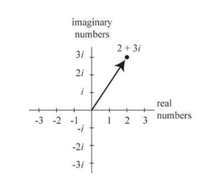

# Complex Numbers

## Definition and Notation

- ℂ = { a + b i : a, b ∈ ℝ, i² = −1 }

## Properties

- ℂ is a **field**: closed under addition (+), multiplication (×), subtraction (−), and division (/)  
- All polynomial equations in one variable can now be solved  
- Complex numbers **cannot be ordered on a single line**, but can be visualized in a plane
