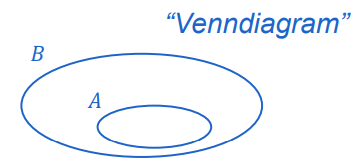

# Subcollections

A is a `subcollection` of B if every element of A also belongs to B.

**Mathematical definition:**  
∀ a ∈ A : a ∈ B

## Notation

- A ⊆ B — A is a subcollection of B  
- A ⊂ B — A is a **strict subcollection** of B (A ⊆ B and A ≠ B)

## Important Consequence

Two collections A and B are **equal** if and only if:  
A ⊆ B **and** B ⊆ A
